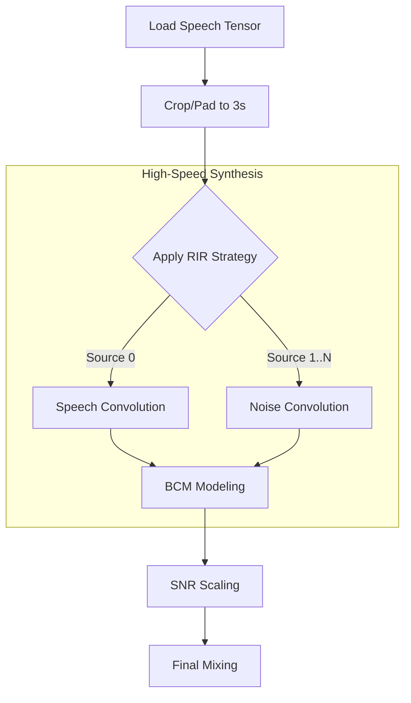

# 🧪 데이터 합성 가이드 (Data Synthesis Guide)

본 문서는 `SpatialMixingDataset` (`src/data/dataset.py`)이 어떻게 원본 음성과 소음 데이터를 RIR(공간 임펄스 응답)과 결합하여 학습용 멀티채널 데이터를 **실시간(On-the-fly) 고속 합성**하는지 설명합니다.

---

## � 1. 핵심 개선 사항 (Optimization)

기존의 느린 CPU 연산을 개선하여 대규모 데이터 학습에 적합하도록 최적화되었습니다.

*   **FFT Convolution**: 기존 `scipy.signal.convolve` (시간 도메인) 대비 수십 배 빠른 `torchaudio.functional.fftconvolve` (주파수 도메인) 사용. 긴 RIR 필터 적용 시 병목 현상 제거.
*   **Tensor-Centric**: 데이터 로드 직후부터 `PyTorch Tensor`로 변환하여, 불필요한 `NumPy <-> Torch` 변환 오버헤드 최소화.
*   **Fixed Chunking**: 모든 출력을 3초(48,000 samples)로 강제 Crop/Pad 하여 `DataLoader`의 배치 구성을 안정화.

---

## 🏗️ 2. 데이터 합성 파이프라인 (Pipeline)

`__getitem__` 호출 시 다음과 같은 순서로 처리가 이루어집니다.



### 🔍 상세 로직 분석

#### 1. Audio Loading & Shaping
*   **코드 위치**: `__getitem__` 초반부
*   **기능**: `soundfile`로 읽은 오디오를 즉시 텐서로 변환하고, 설정된 `chunk_size`(기본 48,000)에 맞춰 랜덤 자르기(Crop) 혹은 제로 패딩(Pad)을 수행합니다. 이는 GPU 텐서 연산의 효율을 극대화합니다.

#### 2. RIR Application (FFT Convolution)
*   **코드 위치**: `_apply_rir` 메서드
*   **핵심 기술**:
    ```python
    # (1, T) * (M, R) -> (M, T+R-1) FFT Convolution
    output = F_audio.fftconvolve(audio, rir_tensor, mode="full")
    ```
    마이크 개수($M$)만큼의 컨볼루션을 한 번의 FFT 연산으로 처리하여 속도를 비약적으로 높입니다.

#### 3. BCM (Bone Conduction) Physics
*   **코드 위치**: `_apply_bcm_modeling` 메서드
*   **기능**: 마지막 채널(Channel 4)에 골전도 센서의 물리적 특성을 입힙니다.
    1.  **LPF (Low Pass Filter)**: 500Hz 이하 주파수만 통과 (피부 진동 특성)
    2.  **Noise High Attenuation**: 외부 소음은 공기 전도 대비 약 20dB 감쇄 (차음 효과)

#### 4. SNR Scaling & Mixing
*   **코드 위치**: `Dataset` 클래스 하단부
*   **로직**:
    *   에너지 계산 시 **BCM 채널을 제외한** 공기 전도 마이크(Air Mics)만을 기준으로 삼습니다.
    *   랜덤하게 설정된 `snr_range` (예: -5~20dB)에 맞춰 소음의 진폭을 조절한 뒤 음성과 합칩니다.

---

## 📦 3. 반환 데이터 구조 (Output)

학습 루프(`LightningModule`)로 전달되는 최종 데이터 형태입니다.

| Key | Shape (C=5, T=48000) | 설명 및 용도 |
| :--- | :--- | :--- |
| `noisy` | `(C, T)` | **[Input]** 음성 + 소음이 섞인 최종 오디오 |
| `clean` | `(C, T)` | **[Target 1]** 잔향(Reverb)이 포함된 깨끗한 음성 |
| `aligned_dry`| `(C, T)` | **[Target 2]** 잔향이 제거되고 시간 정렬된 음성 (De-reverberation용) |
| `snr` | 스칼라 | 적용된 SNR 값 (dB) |
| `rir_id` | `str` | 사용된 RIR 정보 (디버깅용) |
| `noise_only` | `(C, T)` | 소음만 따로 분리된 신호 (분석용) |

---

## ⚙️ 4. 사용 방법

### 데이터셋 초기화
```python
from src.data.dataset import SpatialMixingDataset

dataset = SpatialMixingDataset(
    db_path="data/metadata.db",
    target_sr=16000,
    chunk_size=48000,  # 3초 고정
    is_eval=False      # 학습용 (Eval용은 True)
)
```

### 성능 팁 (Performance Tip)
*   **Num Workers**: `DataLoader`에서 `num_workers`를 충분히(4~8) 주어야 합니다. FFT 연산은 빠르지만, 데이터 로딩과 전처리는 병렬로 처리하는 것이 유리합니다.
