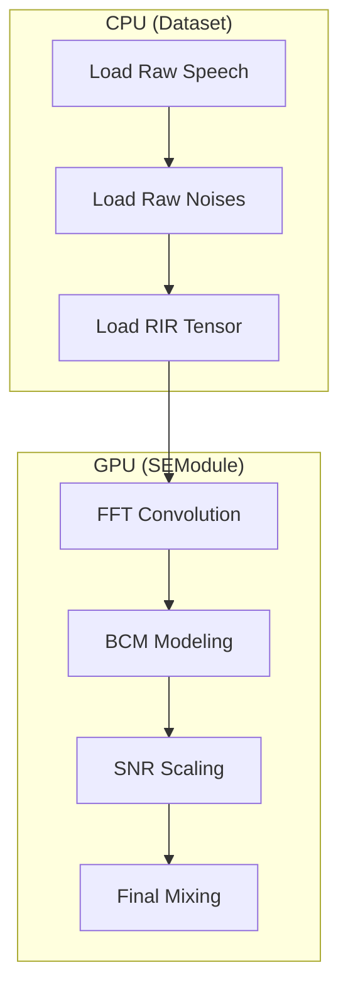

# 🧪 데이터 합성 가이드 (Data Synthesis Guide)

본 문서는 `SpatialMixingDataset` (`src/data/dataset.py`)이 어떻게 원본 음성과 소음 데이터를 RIR(공간 임펄스 응답)과 결합하여 학습용 멀티채널 데이터를 **실시간(On-the-fly) 고속 합성**하는지 설명합니다.

---

## � 1. 핵심 개선 사항 (Optimization)

기존의 느린 CPU 연산을 개선하여 대규모 데이터 학습에 적합하도록 최적화되었습니다.

*   **FFT Convolution**: 기존 `scipy.signal.convolve` (시간 도메인) 대비 수십 배 빠른 `torchaudio.functional.fftconvolve` (주파수 도메인) 사용. 긴 RIR 필터 적용 시 병목 현상 제거.
*   **Tensor-Centric**: 데이터 로드 직후부터 `PyTorch Tensor`로 변환하여, 불필요한 `NumPy <-> Torch` 변환 오버헤드 최소화.
*   **Fixed Chunking**: 모든 출력을 3초(48,000 samples)로 강제 Crop/Pad 하여 `DataLoader`의 배치 구성을 안정화.

---

## 🏗️ 2. 데이터 합성 파이프라인 (Pipeline)

본 프로젝트는 효율성을 위해 **"데이터 로딩은 CPU(Dataset)가, 무거운 합성 연산은 GPU(SEModule)가"** 처리하는 이 단계 구성을 가집니다.



### 🔍 상세 로직 분석 (Technical Breakdown)

#### 1. Audio Loading & Shaping (CPU)
*   **코드 위치**: `src/data/dataset.py` -> `__getitem__`
*   **기능**: `soundfile` 또는 `.npy`로 오디오를 로드한 뒤, `chunk_size`(기본 48,000)에 맞춰 랜덤 크롭(Crop) 또는 제로 패딩(Pad)을 수행합니다. 이는 모든 배치의 타임 스텝을 통일하여 GPU 연산 효율을 극대화합니다.

#### 2. RIR Application & FFT Convolution (GPU)
*   **코드 위치**: `src/modules/se_module.py` -> `_apply_rir`
*   **기술**: `torchaudio.functional.fftconvolve`를 사용합니다. 마이크 개수($M$)와 소스 개수($S$)에 따른 복잡한 컨볼루션을 주파수 도메인에서 한 번에 처리하여, 시간 도메인 연산 대비 수십 배의 성능 향상을 얻습니다.

#### 3. BCM (Bone Conduction) Physics Modeling (GPU)
*   **코드 위치**: `src/modules/se_module.py` -> `_apply_bcm_modeling`
*   **물리 정보 반영**:
    *   **LPF (Low Pass Filter)**: 피부와 근육을 통과하며 고주파가 상실되는 골전도 특성(500Hz~1kHz Cut-off)을 모사합니다.
    *   **Attenuation**: 외부 공기 전도 소음이 골전도 마이크에 작게 유입되는 차음 성능(약 -20dB)을 반영합니다.

#### 4. Dynamic SNR Scaling & Mixing (GPU)
*   **코드 위치**: `src/modules/se_module.py` -> `_apply_gpu_synthesis`
*   **로직**: 믹싱 시 **BCM 채널을 제외한 공기 전도 마이크**의 에너지를 기준으로 SNR을 계산합니다. 설정된 `snr_range` 내에서 랜덤하게 추출된 값으로 노이즈 진폭을 조절하여 최종 `Noisy` 신호를 생성합니다.

---

## 📦 3. 반환 데이터 구조 (Dataset Output)

`Dataset` 클래스가 `DataLoader`를 통해 모델로 전달하는 원본 재료 데이터입니다.

| Key | Shape | 설명 및 용도 |
| :--- | :--- | :--- |
| `raw_speech` | `(T,)` | 공간감이 입혀지기 전의 깨끗한 음성 (Mono) |
| `raw_noises` | `(S_max-1, T)` | 공간감이 입혀지기 전의 노이즈 원본들 |
| `rir_tensor` | `(M, S_max, L)`| 공간 임펄스 응답 (사용하지 않는 슬롯은 0으로 패딩) |
| `noise_ids` | `(S_max-1,)` | 실제 사용된 노이즈 ID들의 텐서 (미사용 슬롯은 `-1`로 패딩) |
| `num_sources`| `int` | 현재 샘플에서 실제로 사용된 소스(음성+노이즈)의 총 개수 |
| `snr` | `float` | 이 샘플에 적용될 목표 SNR 값 |
| `mic_config` | `dict` | BCM 사용 여부 등 마이크 설정 정보 |
| `speech_id` | `int` | 원본 클린 음성의 데이터베이스 ID |
| `rir_id` | `int` | 사용된 RIR의 데이터베이스 ID |

---

## ⚙️ 4. 사용 방법

### 데이터셋 초기화
```python
from src.data.dataset import SpatialMixingDataset

dataset = SpatialMixingDataset(
    db_path="data/metadata.db",
    target_sr=16000,
    chunk_size=48000,
    split="train"  # "train", "val", "test" 중 선택
)
```

### 성능 팁 (Performance Tip)
*   **Num Workers**: `DataLoader`에서 `num_workers`를 충분히(4~8) 주어야 합니다. FFT 연산은 빠르지만, 데이터 로딩과 전처리는 병렬로 처리하는 것이 유리합니다.
